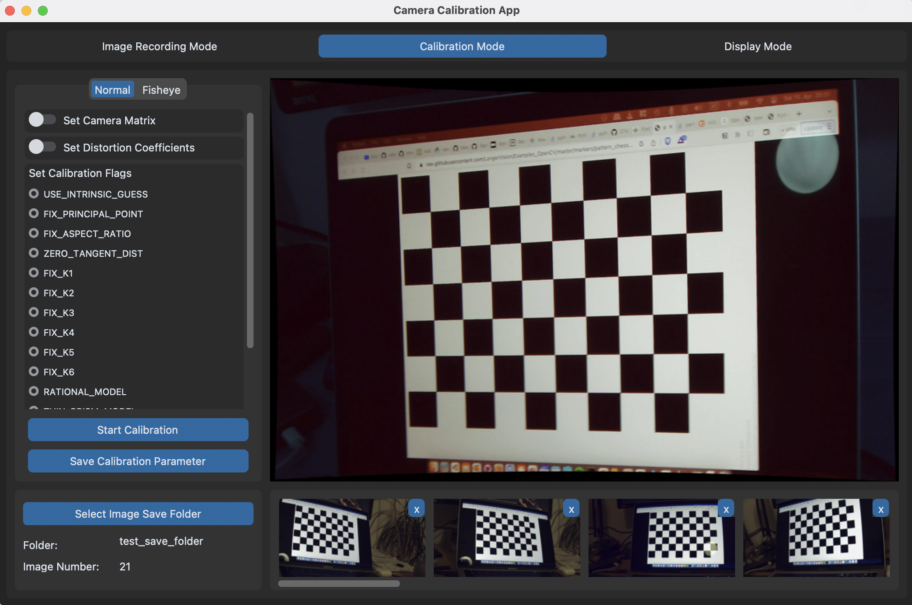

# Camera Calibration GUI

This Software is a GUI to the openCV camera calibration functions. 
It consists of three mayor parts. 
1) Image Recording Mode: 
    Here images of a calibration object can be recorded
2) Calibration Mode:
    Here a calibration Model with corresponding parameter can be selected and the calibration started
3) Display Mode:
    Here the calibration results can be applied on the live camera stream 

## Installation
1) Download the Software: `git clone https://github.com/dlmoser/camera-calibration-gui.git`
2) Create a virtual environment: `python3 -m venv venv`
3) Activate virtual environment: `source venv/bin/activate`
4) Install requirements: `pip install -r requirements.txt`

## Use Software:
1) Navigate with the terminal to the camera calibration gui folder: `cd <path/to/camera-calibration-gui>`
2) Activate virtual environment: `source venv/bin/activate`
3) Run software: `python app.py`

### Image Recording Mode

### Calibration Mode

### Display Mode

   
